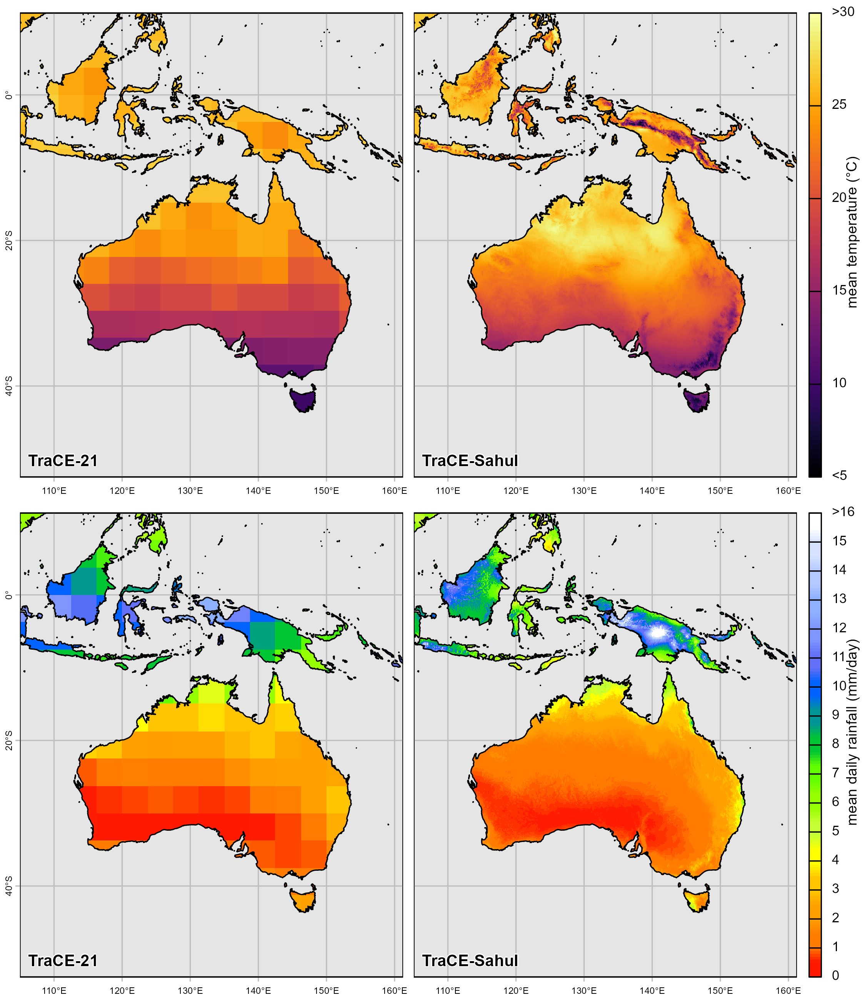

# TraCESahulMisc

**TraCESahulMisc** provides helper functions, workflows, and datasets for downloading, importing, processing, and analysing downscaled TraCE-Sahul palaeoclimate data in R. It supports a complete pipeline: acquiring (an example of) raw TraCE-Sahul files, importing them as `terra::SpatRaster` objects with correct metadata, generating monthly, seasonal, or annual summaries, deriving BIOCLIM variables, and pairing environmental rasters with fossil or observational point data.

 <small>A comparison between the downscaled TraCE-Sahul and raw TraCE-21 data. The top row shows the effect of the downscaling on mean annual temperature, while the bottom row shows the effect on mean annual precipitation.</small>

The package was designed specifically for researchers working with the TraCE-Sahul climate reconstructions, with the aim of automating the aggregation of palaeo-environmental data, and time-series environmental analyses across the Sahul region to be used in species distribution modelling.

## Installation

This package is currently in a **private** GitHub repository. You must be a collaborator to install it directly.

``` r
library(credentials)
library(remotes)
library(usethis)

usethis::use_git_config(user.name = "YourName", user.email = "your@mail.com")
usethis::create_github_token()
credentials::set_github_pat()

remotes::install_github("scbrown86/TraCESahulMisc")
```

Alternatively, clone the repository using GitHub Desktop or CLI and build the package locally in [RStudio](https://support.posit.co/hc/en-us/articles/200486508-Building-Testing-and-Distributing-Packages).

## Key Features

The package helps to automate some basic tasks that are common with palaeo climate reconstructions. It has been built specifically to work the TraCE-Sahul dataset, but *may* work with other datasets provided they have a time attribute (see the [Terra package](https://rspatial.github.io/terra/reference/time.html) for details)

-   Download an example TraCE-Sahul climate dataset.
-   Import multi-layer NetCDF files as annotated `SpatRaster` objects.
-   Summarise TraCE datasets to monthly, seasonal, or annual climatologies.
-   Compute BIOCLIM variables.
-   Pair climate rasters with fossil or observational point data.
-   Includes two example datasets.

# Included Datasets

### `ex_foss`

Example fossil dataset stored as a `SpatVector`, useful for demonstrating pairing workflows.

### `true_suit`

Example `SpatRaster` representing habitat suitability values for a virtual species used for the species distribution modelling demonstration in the vignette.

# Workflow

## 1. download_trace_data()

Downloads a test dataset of raw TraCE-Sahul NetCDF archives to a specified directory.

This function will *not* download the full TraCE-Sahul dataset as it is too large. The filename conventions of the full dataset and the example dataset are identical and **must** be kept this way for the import functions to work.

``` r
download_trace_data("~/Downloads")
```

## 2. import_TraCESahul()

Imports TraCE-Sahul NetCDF files into R as `SpatRaster` objects with complete metadata and TraCESahul structure.

``` r
sahul_tas <- import_TraCESahul("path/to/file.nc")
```

## 3. summarise_TraCESahul()

Aggregates climate rasters to annual, monthly, or seasonal summaries. This summarise step can also work over windows of the data (e.g. a 30 year right aligned window). Data pre- and post-1500CE are never mixed, due to the temporal resolution of the data. Data pre-1500 represent decadal monthly averages, while post-1500 data are a continuous monthly dataset from Jan 1500 to Dec 1989.

``` r
monthly <- summarise_TraCESahul(sahul_tas, type = "monthly", sumfun = "mean")
```

## 4. bioclim_TraCESahul()

Computes BIOCLIM variables from monthly climatology rasters.

``` r
bio_vars <- bioclim_TraCESahul(monthly)
```

## 5. pair_obs()

Pairs fossil/observation point data with environmental rasters, including neighbourhood and distance filtering.

``` r
paired <- pair_obs(ex_foss, bio_vars)
```

# Package Dependencies

-   terra
-   data.table
-   future, future.apply
-   pbapply
-   FNN
-   sf

# Example Full Pipeline

``` r
download_trace_data("~/Downloads")
tas <- import_TraCESahul("~/Downloads/TraCE_22ka_downscaled_tasmax_1500_1990_biascorr.nc")
tas_mon <- summarise_TraCESahul(tas, type = "monthly")
bio <- bioclim_TraCESahul(tas_mon)
paired <- pair_obs(ex_foss, bio)
```

See the package vignette for a full worked example.

# License

MIT License.
