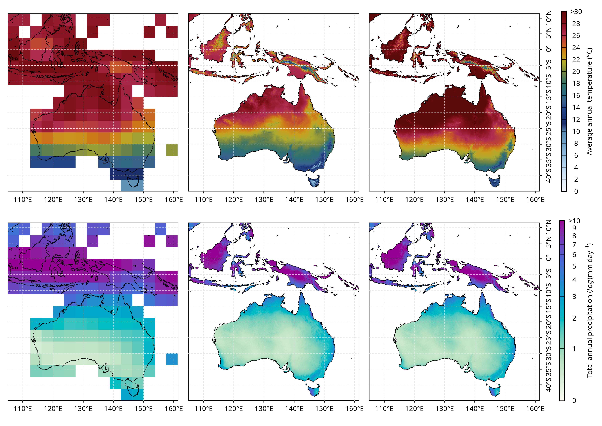

# TraCESahulMisc

**TraCESahulMisc** provides helper functions, workflows, and datasets for downloading, importing, processing, and analysing downscaled TraCE-Sahul palaeoclimate data in R. It supports a complete pipeline: acquiring (an example of) raw TraCE-Sahul files, importing them as `terra::SpatRaster` objects with correct metadata, generating monthly, seasonal, or annual summaries, deriving BIOCLIM variables, and pairing environmental rasters with fossil or observational point data.

The package was designed specifically for researchers working with the TraCE-Sahul climate reconstructions, with the aim of automating the aggregation of palaeo-environmental data, and time-series environmental analyses across the Sahul region to be used in species distribution modelling.

*TraCE-21ka model output at 3.75° resolution (left) and downscaled TraCE-Sahul data at 0.05° resolution (centre), both showing 1961–1990 conditions. The right panel shows downscaled CMIP6 data under SSP5-8.5 for 2100. The top row shows average annual temperature (°C), and the bottom row shows average daily precipitation (mm/day).*

## Installation

The easiest way to install the package is to use `remotes` as below.

``` r
remotes::install_github("scbrown86/TraCESahulMisc", build_vignettes = FALSE)
```

The package contains a pre-built vignette that *should* not be re-built on install so please make sure you set `build_vignettes = FALSE` when installing.

## Vignette

The package constains a small vignette showing some of the functionality.

It can be viewed [here](https://scbrown86.github.io/TraCESahulMisc/TraCESahulMisc_workflow.html), or in RStudio as below

``` r
vignette("TraCESahulMisc_workflow")
```

## Key Features

The package helps to automate some basic tasks that are common with palaeo climate reconstructions. It has been built specifically to work the TraCE-Sahul dataset, but *may* work with other datasets provided they have a time attribute (see the [Terra package](https://rspatial.github.io/terra/reference/time.html) for details)

- Download example TraCE-Sahul datasets for the periods 22ka BP to 1989 and 1990 to 2100.
- Import multi-layer NetCDF files as annotated `SpatRaster` objects.
- Summarise TraCE datasets to monthly, seasonal, or annual climatologies.
- Compute BIOCLIM variables.
- Pair climate rasters with fossil or observational point data.

See the package vignette for a full worked example on using the dataset

## License

MIT License.
